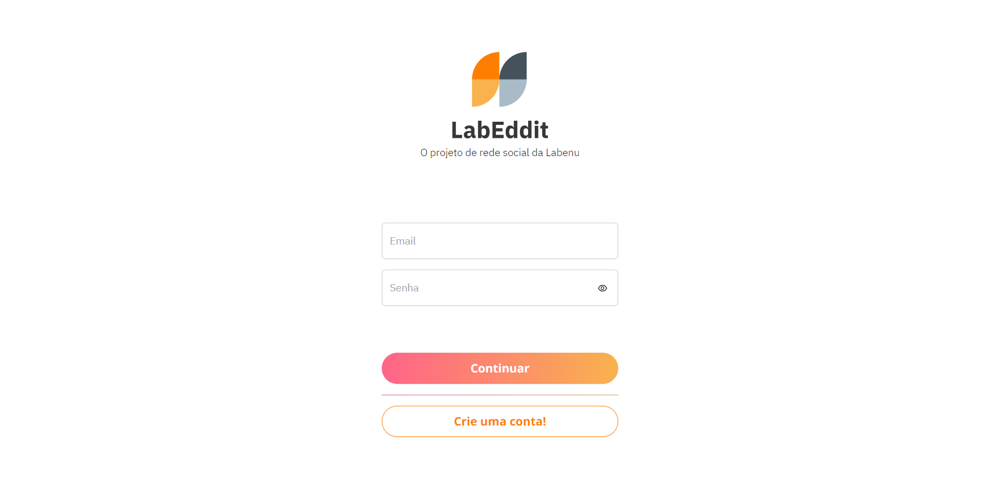

# Labeddit - Frontend



## Introdução

Labeddit é uma rede social fictícia criada como projeto final do bootcamp **Web FullStack** da **Labenu**. O projeto é dividido em dois repositórios: **labeddit-backend** e **labeddit-frontend**.

Este repositório contém o **frontend**, desenvolvido com **React.js** e **Vite**. Nele, os usuários podem se cadastrar, fazer login, visualizar uma lista de posts, interagir com posts e comentários e criar seus próprios conteúdos. A autenticação é feita com **JWT** armazenado em cookies. Inspirado na rede social **Reddit**.


## Link de Acesso

- **Deploy no Vercel:** [Acessar aplicação](https://labeddit-frontend-suuzanemoura.vercel.app)
- **Repositório Backend:** [Ver Backend](https://github.com/suuzanemoura/labeddit-backend)

## Sobre o Projeto

### Instalação

```bash
# Instale todas as dependências
$ npm install

# Execute o projeto em modo de desenvolvimento
$ npm run dev

# A aplicação será iniciada na porta 5173
```

### Bibliotecas Utilizadas


- `react-router-dom` → Gerenciamento de rotas;
- `axios` → Requisições HTTP;
- `react-icons` → Ícones;
- `date-fns` → Manipulação de datas;
- `jose` → Decodificação de JWT;
- `react-toastify` → Notificações;
- `universal-cookie` → Gerenciamento de cookies;
- `tailwindcss, postcss, autoprefixer` → Estilização;

### Tecnologias

- **React.js**
- **React Hooks**
- **Context API**
- **Autenticação e autorização (JWT)**
- **Cookies**
- **TailwindCSS**

## Funcionalidades

- **Rotas públicas:**
  - Cadastro de usuário;
  - Login de usuário;
  - Página 404 para rotas inexistentes;
- **Rotas protegidas por autenticação:**
  - Visualizar lista de posts:
    - Exibe data de criação;
    - Exibe username do autor;
    - Número de likes e comentários;
    - Ordenar por mais recentes ou mais populares (likes);
  - Criar novo post;
  - Curtir ou descurtir posts de outros usuários;
  - Visualizar post específico com comentários:
    - Comentários com data de criação, username do autor e likes;
  - Criar novo comentário;
  - Curtir ou descurtir comentários de outros usuários;
  - Logout (sair da rede social);

  **Observação:** Não é possível curtir ou descurtir seus próprios posts ou comentários.

## Destaques do Projeto

- Estrutura completa de autenticação com JWT e cookies.
- Integração total com API RESTful (backend próprio).
- Interface responsiva com TailwindCSS.
- Ordenação dinâmica de posts (mais recentes e mais populares).
- Separação entre rotas públicas e privadas.
- Boas práticas de componentização e gerenciamento de estado com Context API.
- Feedbacks visuais com notificações (Toastify).

## Melhorias em Potencial
- Possibilidade de excluir um post;
- Possibilidade de excluir um comentário;
- Visualizar página com informações do usuário;
- Excluir sua conta;
- Editar um post;
- Editar um comentário;
- Editar informações do usuário (username, email e senha).

## Status do projeto

- ✅ Projeto concluído – aberto a melhorias futuras conforme disponibilidade.

##  **Contato**  
[](mailto:suuzanemoura@gmail.com)
[](https://www.linkedin.com/in/suuzanemoura)
[](https://www.behance.net/suzanemoura)
